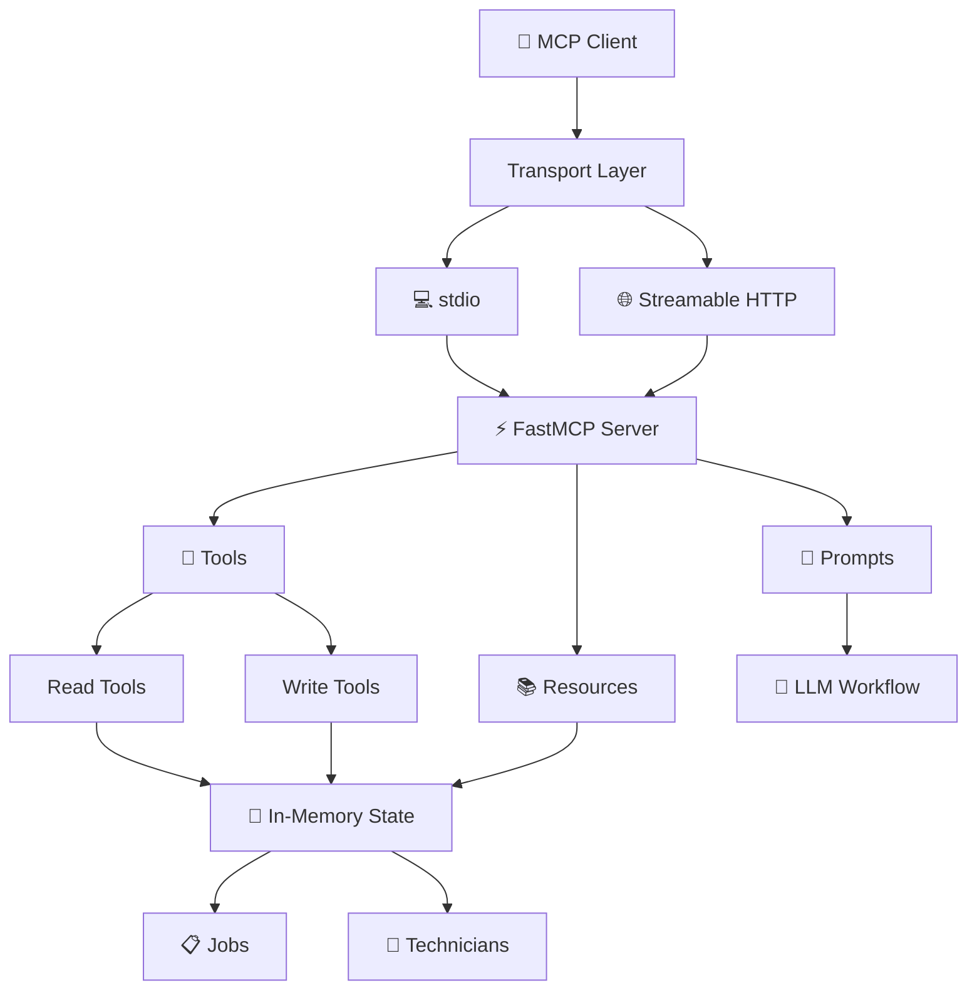
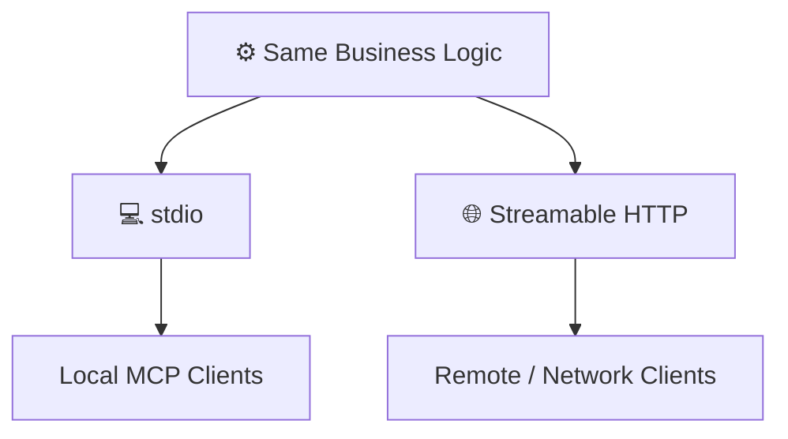

<div align="center">

# 🚀 Task 1 — MCP Server

### A production-oriented Model Context Protocol server for managing jobs and field technicians

<p>
  
  
  
  
</p>

<p>
  <strong>8 Tools</strong> ·
  <strong>3 Resources</strong> ·
  <strong>2 Prompts</strong> ·
  <strong>Typed Schemas</strong> ·
</p>

</div>

---

## 📌 Overview

This project is a **Model Context Protocol (MCP) server** that models a small field-service workflow for managing **jobs** and **technicians**.

It demonstrates how one MCP server can expose the same business logic through two transport modes:

- 💻 **stdio** — for local MCP clients and agent workflows
- 🌐 **Streamable HTTP** — for remote and networked clients

---

## ✨ Features

| Feature | Details |
|:---|:---|
| 🔧 **8 MCP Tools** | 4 read tools + 4 write tools |
| 📚 **3 Resources** | Structured access to current application state |
| 🤖 **2 Prompts** | Job triage and technician assignment recommendations |
| 🧩 **FastMCP** | MCP server implementation |
| 🛡️ **Pydantic Schemas** | Explicit typed inputs and outputs |
| 💾 **In-Memory State** | No database setup required |
| 💻 **stdio Transport** | Local agent/client workflows |
| 🌐 **Streamable HTTP** | Remote/networked integrations |
| 🔍 **MCP Inspector Ready** | Easy manual testing and debugging |
| ⚠️ **Actionable Errors** | Errors include suggested next actions |

---

## 🧠 What This Project Demonstrates

This project brings together the three main MCP primitives used by the application:

```text
┌──────────────────────────────────────────────────────────────┐
│                         MCP SERVER                           │
├──────────────────────┬──────────────────────┬────────────────┤
│       🔧 TOOLS       │     📚 RESOURCES     │   🤖 PROMPTS    │
├──────────────────────┼──────────────────────┼────────────────┤
│ • Read operations    │ • Jobs               │ • Job triage    │
│ • Write operations   │ • Open jobs          │ • Assignment    │
│                      │ • Available techs    │   suggestion    │
└──────────────────────┴──────────────────────┴────────────────┘
                              │
                              ▼
                    ┌───────────────────┐
                    │  💾 In-Memory     │
                    │      State        │
                    └───────────────────┘
```

### MCP Primitives in This Project

| Primitive | Count | Purpose |
|:---|:---:|:---|
| 🔧 Tools | **8** | Perform read and state-changing operations |
| 📚 Resources | **3** | Expose current structured application state |
| 🤖 Prompts | **2** | Provide reusable LLM workflow templates |

---

## 🏗️ Architecture



---

# 📋 Domain Model

The application models two main entities:

- 📋 Jobs
- 👷 Technicians

---

## 📋 Jobs

Each job contains:

| Field | Description |
|:---|:---|
| `id` | Unique job identifier |
| `title` | Short job title |
| `description` | Detailed description of the issue/task |
| `priority` | Job priority |
| `status` | Current job status |
| `technician_id` | Assigned technician ID, when applicable |

---

## 👷 Technicians

Each technician contains:

| Field | Description |
|:---|:---|
| `id` | Unique technician identifier |
| `name` | Technician name |
| `available` | Whether the technician is currently available |
| `skills` | Technician skill set |

---

# 🔧 MCP Tools

The server exposes **8 tools**:

- **4 read tools**
- **4 write tools**

## Tool Overview

| # | Tool | Type | Description |
|:---:|:---|:---:|:---|
| 1 | `list_jobs` | 🟢 Read | Returns all jobs |
| 2 | `list_technicians` | 🟢 Read | Returns all technicians |
| 3 | `get_available_technicians` | 🟢 Read | Returns available technicians |
| 4 | `open_jobs` | 🟢 Read | Returns open jobs |
| 5 | `create_job` | 🔴 Write | Creates a new job |
| 6 | `assign_job` | 🔴 Write | Assigns an available technician |
| 7 | `update_job` | 🔴 Write | Partially updates an existing job |
| 8 | `delete_job` | 🔴 Write | Deletes a job and restores technician availability when required |

---

# ⚖️ Design Decisions and Transport Trade-offs

This section explains the reasoning behind the tool split and the trade-offs between the two supported MCP transports.

## 🔧 Why the Tools Are Split Into Focused Read and Write Operations

The tools are intentionally separated by responsibility:

- Read tools inspect or filter application state without changing it.

- Write tools perform explicit state-changing operations such as creating, assigning, updating, or deleting jobs.

This design was chosen because smaller, focused tools are easier for MCP clients and LLM agents to understand and select correctly. It also makes permissions, validation, testing, debugging, and error handling easier to reason about.

The trade-off is that a workflow may require multiple tool calls instead of one large call. For example, an agent may need to call open\_jobs, then get\_available\_technicians, and finally assign\_job. The additional calls are accepted in exchange for clearer responsibilities and safer, more predictable tool usage.

## 🌐 Transport Trade-offs: stdio vs Streamable HTTP

The project supports both stdio and Streamable HTTP because they serve different deployment needs.

Transport

Advantages

Trade-offs

💻 stdio

Simple local communication, easy to run with local MCP clients, no network server or port configuration required

Best suited to local workflows; it is not designed for general remote/network access

🌐 Streamable HTTP

Supports networked and remote clients, making the server easier to expose as a service

Requires an HTTP server, port configuration, and additional network/deployment considerations

Why support both?

Using stdio provides a lightweight and simple option for local agent workflows, while Streamable HTTP provides flexibility for remote or network-based integrations.

The main trade-off is simplicity vs network accessibility:

- Choose stdio when the MCP client and server run locally and simplicity is the priority.

- Choose Streamable HTTP when clients need to communicate with the MCP server over a network.

Both transports use the same underlying business logic, so choosing a transport does not require duplicating the tools or application behavior. The trade-off is therefore primarily about how the client connects to the server, rather than changing what the server can do.

---

# 📚 MCP Resources

The server exposes **3 resources**:

```text
jobs://all
jobs://open
technicians://available
```

## Resource Overview

| Resource URI | Purpose |
|:---|:---|
| `jobs://all` | Current list of all jobs |
| `jobs://open` | Current list of open jobs |
| `technicians://available` | Current list of available technicians |

These resources provide structured access to the current in-memory state.

> ℹ️ **Implementation Note:** The current implementation uses the `task-1://` URI namespace. If strict `jobs://...` URIs are required by the original specification, the resource URI definitions would need a small code change.

---

# 🤖 MCP Prompts

The server exposes **2 reusable MCP prompts**.

## `triage_job`

### Input

```text
job_id
```

### Purpose

Produces a structured triage prompt for an LLM to analyze a specific job.

The prompt helps an LLM assess:

- Severity
- Urgency
- Required skills
- Recommended next steps

---

## `assign_suggestion`

### Input

```text
job_id
```

### Purpose

Produces a prompt asking an LLM to select the best available technician for a job.

The recommendation considers:

- Skill match
- Technician availability
- Job priority

---

# 🛡️ Input Schemas

All write-tool inputs use explicit **Pydantic models**:

```text
CreateJobInput
AssignJobInput
UpdateJobInput
DeleteJobInput
```

This provides a typed and predictable MCP contract.

### Benefits

- ✅ Input validation
- ✅ Explicit contracts
- ✅ Better tool discoverability
- ✅ Predictable behavior
- ✅ Easier testing
- ✅ Easier integration with MCP clients
- ✅ Better support for LLM tool calling

---

# 📦 Output Schemas

The project uses typed response models:

```text
JobsOutput
TechniciansOutput
JobOutput
JobMutationResponse
```

Structured outputs make responses:

- Easier to validate
- Easier to consume
- More predictable for MCP clients
- Better suited to programmatic workflows

---

# 🌐 Transport Modes

The same business logic is available through two transport modes.



---


## 💻 stdio

```bash
TRANSPORT_TYPE=stdio
```

## 🌐 HTTP

```bash
TRANSPORT_TYPE=HTTP
TRANSPORT_PORT=3000
```

> ⚠️ **Important:** The code currently checks `TRANSPORT_TYPE`, not `TRANSPORT`. This README reflects the implementation currently present in the repository.

---

# 🚀 Installation

## Prerequisites

Make sure you have:

- Python **3.12+**
- `pip` or `uv`
- Node.js / `npx` if you want to use MCP Inspector

---

## Option 1 — pip

Install the project in editable mode:

```bash
pip install -e .
```

Editable installation is convenient during development because source changes are immediately available.

---

## Option 2 — uv

If you use `uv`:

```bash
uv sync
```

---

# ▶️ Running the Server

## 💻 stdio Mode

### Linux / macOS

```bash
TRANSPORT_TYPE=stdio python -m src.mcp_server.server
```

### Windows PowerShell

```powershell
$env:TRANSPORT_TYPE="stdio"
python -m src.mcp_server.server
```

---

## 🌐 HTTP Mode

### Linux / macOS

```bash
TRANSPORT_TYPE=HTTP TRANSPORT_PORT=3000 python -m src.mcp_server.server
```

### Windows PowerShell

```powershell
$env:TRANSPORT_TYPE="HTTP"
$env:TRANSPORT_PORT="3000"
python -m src.mcp_server.server
```

The HTTP server runs on port:

```text
3000
```

---

# 🔍 MCP Inspector

The project is designed to be verified with **MCP Inspector**.

Inspector can be used to manually inspect:

- 🔧 Tools
- 📚 Resources
- 🤖 Prompts
- 📥 Input schemas
- 📤 Tool responses
- 🔄 State mutations
- 🚦 Transport connectivity

---

## Install / Run Inspector

```bash
npx @modelcontextprotocol/inspector
```

Then connect Inspector to the appropriate server configuration.

---

## 💻 Inspect stdio

Start the server:

```bash
TRANSPORT_TYPE=stdio python -m src.mcp_server.server
```

Then configure MCP Inspector to connect to the local stdio server process.

---

## 🌐 Inspect HTTP

Start the server:

```bash
TRANSPORT_TYPE=HTTP TRANSPORT_PORT=3000 python -m src.mcp_server.server
```

Then connect MCP Inspector to the HTTP endpoint.

---

# 🧩 Tool Design Philosophy

The tools are deliberately split into **read** and **write** operations.

## 🟢 Read Operations

Read tools are side-effect free and focus on:

- Discovery
- Inspection
- Filtering
- State checking

```text
list_jobs
list_technicians
get_available_technicians
open_jobs
```

These are natural starting points for an agent before it performs an action.

---

## 🔴 Write Operations

Write tools explicitly mutate state:

```text
create_job
assign_job
update_job
delete_job
```

Keeping mutations explicit helps MCP clients and LLM agents understand when an operation changes application state.

---

## 💡 Why Not Combine Everything Into One Tool?

A single large tool could theoretically perform discovery, validation, assignment, updates, and deletion.

However, smaller focused tools provide:

- 🧠 Clearer mental models
- 🛡️ Safer agent behavior
- 🧪 Easier testing
- 📖 Better documentation
- 🐛 Easier debugging
- 🔎 Better tool discoverability
- 🎯 More predictable tool selection

The trade-off is that some workflows require multiple tool calls.

For example:

```text
open_jobs
    ↓
get_available_technicians
    ↓
assign_job
```

This is intentional.

---

# 🚀 Quick Start

For the fastest way to run the project:

### 1. Install

```bash
uv sync
```

### 2. Start with stdio

```bash
TRANSPORT_TYPE=stdio python -m src.mcp_server.server
```

### 3. Or start HTTP

```bash
TRANSPORT_TYPE=HTTP TRANSPORT_PORT=3000 python -m src.mcp_server.server
```

### 4. Start MCP Inspector

```bash
npx @modelcontextprotocol/inspector
```
---


# 📄 License

No license has been specified for this project yet.

---

<div align="center">

## ⭐ Task 1 — MCP Server

**Built with Python + FastMCP + Pydantic**

💻 Local workflows · 🌐 Remote clients · 🔧 Tools · 📚 Resources · 🤖 Prompts

</div>
