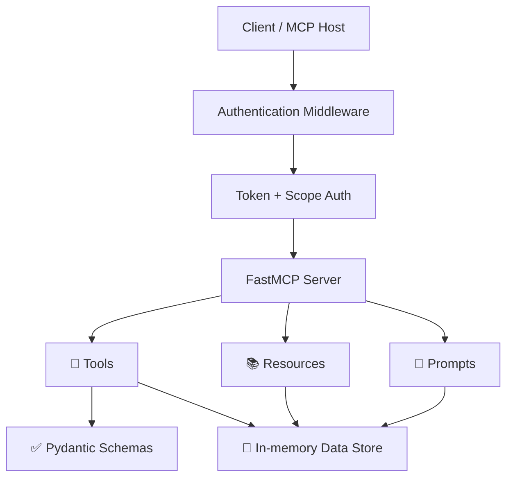

<div align="center">

# 🚀 Task 2 — MCP Server

### 🔐 Authenticated Field-Service Model Context Protocol Server

A production-oriented **Model Context Protocol (MCP) server** for managing jobs and field technicians, with authentication, scope-based authorization, cursor-based pagination, typed validation, structured errors, and support for both **stdio** and **Streamable HTTP** transports.

<p>
  
  
  
  
</p>

<p>
  <strong>8 Tools</strong> ·
  <strong>3 Resources</strong> ·
  <strong>2 Prompts</strong> ·
  <strong>Token Authentication</strong> ·
  <strong>Cursor Pagination</strong>
</p>

</div>

---

## 📌 Overview

This project is a **Model Context Protocol (MCP) server** for a field-service workflow. It exposes:

- 🔧 Read tools for browsing jobs and technicians
- ✏️ Write tools for creating, updating, assigning, and deleting jobs
- 📚 Resources for direct data access
- 🤖 Prompts for job triage and technician assignment guidance

The server uses:

- 🔐 Token-based authentication
- 🛡️ Scope-based authorization
- ✅ Pydantic validation
- ⚠️ Custom structured error responses
- 📄 Cursor-based pagination
- 🏷️ MCP tool annotations
- 💻 `stdio` transport
- 🌐 `HTTP` / Streamable HTTP transport

---

## 🧰 Technologies Used

| Technology | Purpose |
|:---|:---|
| 🐍 **Python 3.12** | Application runtime |
| ⚡ **FastMCP** | MCP server implementation |
| 🔌 **MCP (Model Context Protocol)** | Tool, resource, and prompt interface |
| ✅ **Pydantic** | Input and output validation |
| 🌱 **python-dotenv** | Environment/configuration support |
| 🧩 **Python Standard Library** | Core utilities and server functionality |

Standard library modules used include:

- `os`
- `time`
- `secrets`
- `string`

---

## 🏗️ Architecture



### 🔄 Request Flow

```text
┌─────────────────────┐
│   MCP Client/Host   │
└──────────┬──────────┘
           │
           ▼
┌─────────────────────┐
│ Authentication      │
│ Middleware          │
└──────────┬──────────┘
           │
           ▼
┌─────────────────────┐
│ Token + Scope       │
│ Authorization        │
└──────────┬──────────┘
           │
           ▼
┌─────────────────────┐
│    FastMCP Server   │
└──────┬──────┬───────┘
       │      │
       ▼      ▼
    Tools  Resources
       │      │
       └──┬───┘
          ▼
 ┌───────────────────┐
 │ In-Memory Data    │
 │ Store             │
 └───────────────────┘
```

---

## 📁 Project Structure

```text
task-2/
│
├── src/
│   └── mcp_server/
│       ├── server.py              # Main FastMCP server setup
│       ├── auth/                   # Token verification and scope authorization
│       ├── middleware/             # Request authentication middleware
│       ├── tools/                  # Read and write MCP tools
│       ├── resources/              # MCP resources for jobs and technicians
│       ├── prompts/                # Reusable prompts
│       ├── schemas/                # Input, output, and error schemas
│       ├── services/               # Helper validation services
│       ├── data/                   # In-memory sample data and token registry
│       └── core/                   # Constants, config, and logging
│
├── pyproject.toml                  # Project configuration and dependencies
├── uv.lock                         # Locked dependency versions
└── README.md                       # Project documentation
```

---

# 🔧 Tools, Resources, and Prompts

## 🔧 Tools

| Name | Type | Description |
|:---|:---|:---|
| `job_server_list_jobs` | 🟢 Read | Lists jobs with cursor-based pagination. |
| `job_server_list_technicians` | 🟢 Read | Lists all technicians with cursor-based pagination. |
| `job_server_get_available_technicians` | 🟢 Read | Lists only available technicians with cursor-based pagination. |
| `job_server_open_jobs` | 🟢 Read | Lists only open jobs with cursor-based pagination. |
| `job_server_create_job` | 🔴 Write | Creates a new job with validation and duplicate checking. |
| `job_server_assign_job` | 🔴 Write | Assigns an open job to an available technician. |
| `job_server_update_job` | 🔴 Write | Updates one or more fields on an existing job. |
| `job_server_delete_job` | 🔴 Write | Deletes a job and frees the assigned technician if needed. |

## 📚 Resources

| Name | Type | Description |
|:---|:---|:---|
| `task-1://list_of_jobs` | Resource | Returns the full job list as JSON. |
| `task-1://list_of_open_jobs` | Resource | Returns only open jobs as JSON. |
| `task-1://available_technicians` | Resource | Returns only available technicians as JSON. |

## 🤖 Prompts

| Name | Type | Description |
|:---|:---|:---|
| `triage_job` | Prompt | Produces a structured triage prompt for a specific job. |
| `assign_suggestion` | Prompt | Produces a technician recommendation prompt for a specific job. |

---

# 🔐 Authentication Flow

Authentication is handled by middleware **before MCP requests are processed**.

```text
Incoming Request
       │
       ▼
┌─────────────────────────────┐
│ AuthenticationMiddleware    │
└─────────────┬───────────────┘
              │
              ▼
       Read Authentication Token
              │
       ┌──────┴──────┐
       ▼             ▼
     HTTP           STDIO
       │             │
 auth_token      AUTH_TOKEN
   header        environment
       └──────┬──────┘
              ▼
       Verify Token
              │
              ▼
       Check Token Expiry
              │
              ▼
       Determine Required Scope
              │
       ┌──────┴──────┐
       ▼             ▼
     read          write
       │             │
       └──────┬──────┘
              ▼
       Validate Token Scope
              │
       ┌──────┴──────┐
       ▼             ▼
    ❌ Reject       ✅ Allow
       │             │
       ▼             ▼
 Structured       MCP Request
   Error
```

### Authentication Steps

1. The request enters `AuthenticationMiddleware`.
2. In HTTP mode, the middleware looks for an `auth_token` header.
3. In `STDIO` mode, the token is read from the `AUTH_TOKEN` environment variable.
4. The token is verified against the in-memory token registry.
5. Token expiry is checked.
6. The middleware determines whether the request requires `read`, `write`, or no scope.
7. If the token lacks the required scope, the request is rejected with a structured error response.

---

## 🛡️ Scope-Based Access Control

- `read` scope is required for read-only MCP methods and read tools.
- `write` scope is required for write tools.
- Unsupported or unknown operations are denied.

This design keeps access control simple and explicit: tokens can be issued with only the minimum scope needed for a task.

### 🔑 Scope Model

| Scope | Allowed Operations |
|:---|:---|
| `read` | List jobs, list technicians, open jobs, available technicians |
| `write` | Create, assign, update, and delete jobs |

---

## 🔑 Manual Authentication Setup

To authenticate manually, provide a bearer token that matches the token registry used by the server.

### 🌐 HTTP Transport

Send the token in the `auth_token` header:

```http
auth_token: Bearer YOUR_TOKEN_HERE
```

The token must:

- Exist in the registry
- Not be expired
- Have the required scope for the requested operation

### 💻 stdio Transport

Set the `AUTH_TOKEN` environment variable before starting the server:

```bash
AUTH_TOKEN="Bearer YOUR_TOKEN_HERE"
```

---

# 📄 Pagination

All list-style read tools use **cursor-based pagination**.

| Field | Description |
|:---|:---|
| `cursor` | Marks the next starting position |
| `limit` | Controls how many items are returned |
| `next_cursor` | Cursor for the next request |
| `has_more` | Indicates whether more records are available |
| `total_count` | Total number of records |

## ❗ Why Cursor-Based Pagination?

**Pagination must be cursor-based, not page-number-based.**

Cursor pagination is more stable when the underlying dataset changes between requests.

### Why not page numbers?

With page-number pagination:

```text
Request 1 → Page 1 → Items 1–10

A new item is inserted

Request 2 → Page 2 → Items may have shifted
```

This can cause:

- ❌ Duplicate records
- ❌ Skipped records
- ❌ Inconsistent results

With cursor pagination:

```text
Request 1
   │
   ▼
Items 1–10
   │
   ▼
next_cursor = 10
   │
   ▼
Request 2
   │
   ▼
Continue after cursor 10
```

The cursor makes the next fetch position explicit and predictable.

### Example Input

```json
{
  "cursor": "10",
  "limit": 5
}
```

### Response Fields

```text
data
next_cursor
has_more
total_count
```

---

# ✅ Validation

This server uses **Pydantic models** for input and output validation.

### Input Validation

- Required fields are enforced
- String fields use length constraints
- Pagination limits are bounded between `1` and `100`
- Enums restrict values for `priority` and `status`

### Output Validation

- Tool outputs use typed response models
- Mutation responses include success state, message, and job details
- Pagination responses always include consistent metadata

---

# ⚠️ Custom Error Schema

Errors follow a structured schema with:

| Field | Description |
|:---|:---|
| `error` | Human-readable message |
| `code` | Machine-readable error code |
| `suggestion` | Recommended next step |

This makes failures easier to handle programmatically and easier to understand for users.

---

# 🏷️ Tool Annotations

Each tool declares MCP annotations so clients can understand behavior:

- `readOnlyHint`
- `destructiveHint`
- `idempotentHint`
- `openWorldHint`

These annotations help clients and hosts reason about **safety, side effects, and tool behavior**.

---

# ✨ Features

| Feature | Description |
|:---|:---|
| 🔐 **Token Authentication** | Protects MCP operations using authentication tokens |
| 🛡️ **Scope-Based Access Control** | Read tools require `read`; write tools require `write` |
| ⚠️ **Custom Error Schema** | Provides structured error, code, and suggestion fields |
| 📄 **Cursor Pagination** | Stable sequential retrieval for changing datasets |
| ✅ **Pydantic Validation** | Typed input and output validation |
| 🏷️ **Tool Annotations** | Describes tool safety and side effects |
| 💻 **stdio Transport** | Supports local MCP workflows |
| 🌐 **HTTP Transport** | Supports network-based MCP workflows |
| 📚 **Resources** | Provides direct access to structured job/technician data |
| 🤖 **Prompts** | Provides reusable triage and assignment guidance |

---

# 🚀 Clone and Run

## 📋 Prerequisites

Make sure you have:

- **Python 3.12+**
- **uv**
- An MCP-compatible client or MCP Inspector

## 1️⃣ Clone the Repository

```bash
git clone <REPO_URL>
cd task-2
```

## 2️⃣ Install Dependencies

```bash
uv sync
```

## 3️⃣ Run in `stdio` Mode

### Windows CMD

```cmd
set TRANSPORT_TYPE=STDIO
set AUTH_TOKEN=Bearer YOUR_TOKEN_HERE

uv run python -m src.mcp_server.server
```

### PowerShell

```powershell
$env:TRANSPORT_TYPE="STDIO"
$env:AUTH_TOKEN="Bearer YOUR_TOKEN_HERE"

uv run python -m src.mcp_server.server
```

### Linux / macOS

```bash
export TRANSPORT_TYPE=STDIO
export AUTH_TOKEN="Bearer YOUR_TOKEN_HERE"

uv run python -m src.mcp_server.server
```

## 4️⃣ Run in `http` Mode

### Windows CMD

```cmd
set TRANSPORT_TYPE=HTTP
set TRANSPORT_PORT=3000

uv run python -m src.mcp_server.server
```

### PowerShell

```powershell
$env:TRANSPORT_TYPE="HTTP"
$env:TRANSPORT_PORT="3000"

uv run python -m src.mcp_server.server
```

### Linux / macOS

```bash
export TRANSPORT_TYPE=HTTP
export TRANSPORT_PORT=3000

uv run python -m src.mcp_server.server
```

### ⚙️ Environment Variables

| Variable | Purpose | Example |
|:---|:---|:---|
| `TRANSPORT_TYPE` | Selects the server transport | `STDIO` / `HTTP` |
| `TRANSPORT_PORT` | HTTP server port | `3000` |
| `AUTH_TOKEN` | Authentication token for stdio | `Bearer YOUR_TOKEN_HERE` |

---

# 🧪 Example Usage

### 📋 Read Jobs

```json
{
  "cursor": null,
  "limit": 10
}
```

### ➕ Create a Job

```json
{
  "id": "JOB-1001",
  "title": "Replace router",
  "description": "Customer reports router failure and no connectivity.",
  "priority": "high"
}
```

### 👷 Assign a Job

```json
{
  "job_id": "JOB-1001",
  "technician_id": "TECH-01"
}
```

---

# 🧩 Implementation Notes

- 💾 Data is currently stored in memory.
- 🔑 Tokens are also stored in memory in the token registry.
- 🏷️ The `job_server` namespace is added with `Namespace("job_server")`.
- 🔐 The middleware protects both tools and resources.
- 🚦 Both `stdio` and `HTTP` transport modes are supported.

---

# ⚖️ Design Decisions & Trade-offs

## 🔧 Why Split the Tools?

The tools are deliberately divided into focused **read** and **write** operations instead of using one large multi-purpose tool.

This provides:

- Clearer responsibilities
- Safer agent behavior
- Easier testing
- Better documentation
- Easier debugging
- Better tool discoverability
- More predictable tool selection
- Easier scope-based authorization

### Trade-off

The main trade-off is that some workflows require **multiple tool calls**.

For example:

```text
open_jobs
    ↓
get_available_technicians
    ↓
assign_job
```

A single large tool could potentially perform the whole workflow, but separating responsibilities makes the individual operations easier for MCP clients and LLM agents to understand and use safely.

---

## 🚦 Transport Trade-offs

The server supports both **stdio** and **HTTP** because they serve different use cases.

| Transport | Advantages | Trade-offs |
|:---|:---|:---|
| 💻 **stdio** | Simple, lightweight, and well suited to local MCP clients | Primarily designed for local client/server workflows |
| 🌐 **HTTP** | Supports networked and remote MCP clients | Requires HTTP configuration, a port, and additional network considerations |

### The Core Trade-off

> **stdio → simplicity and local communication**

> **HTTP → network accessibility and remote integration**

Both transports use the same underlying MCP tools and business logic. The transport choice therefore changes **how clients connect to the server**, not what the server can do.

---

# 📄 License

No license file is currently included in the repository.

---

<div align="center">

### 🚀 Task 2 — MCP Server

**Built with Python + FastMCP + Pydantic**

🔐 Authentication · 🛡️ Authorization · 🔧 Tools · 📚 Resources · 🤖 Prompts

</div>
