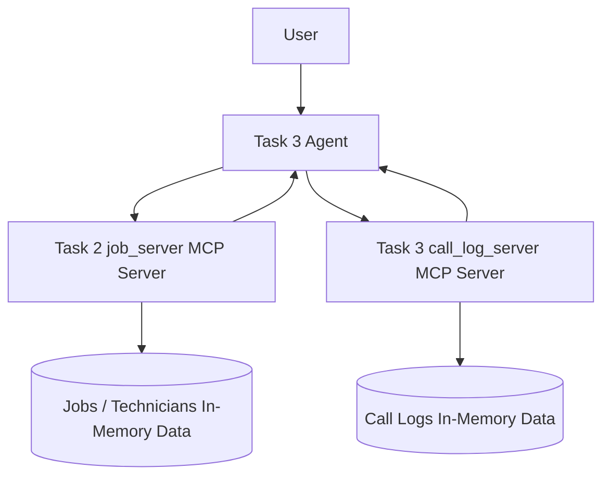
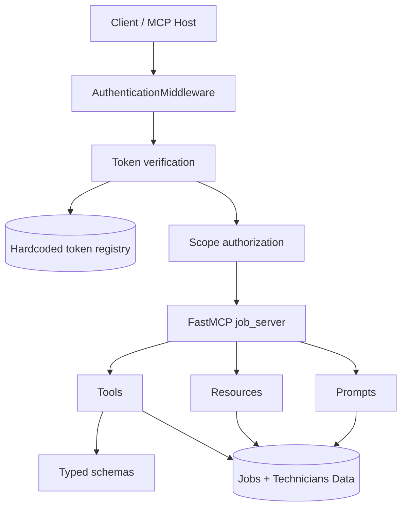
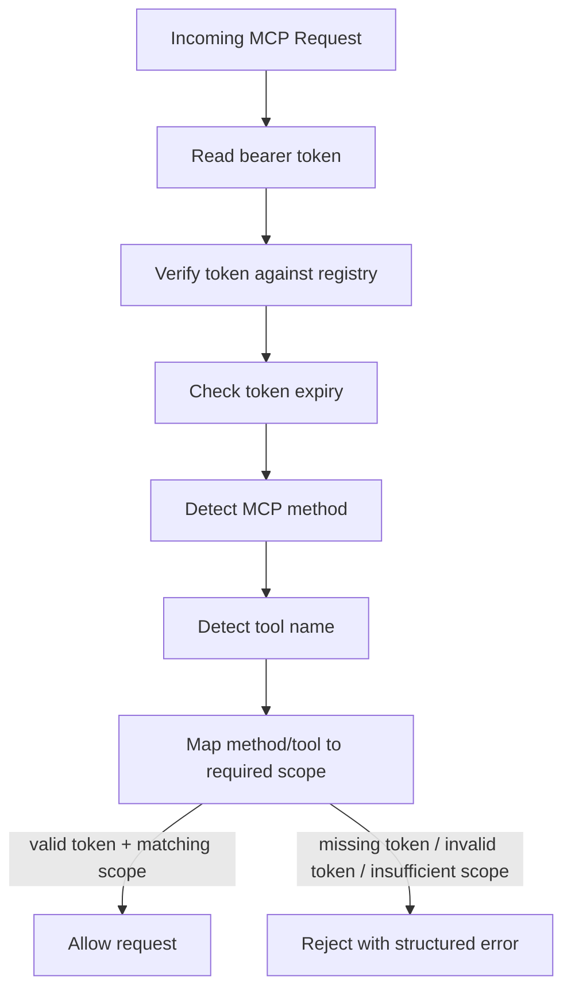
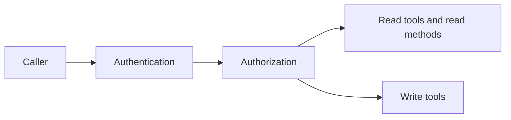
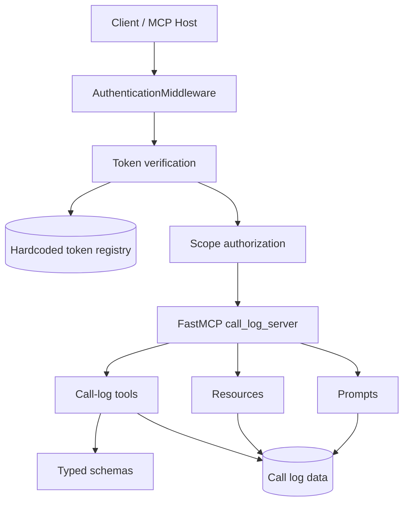
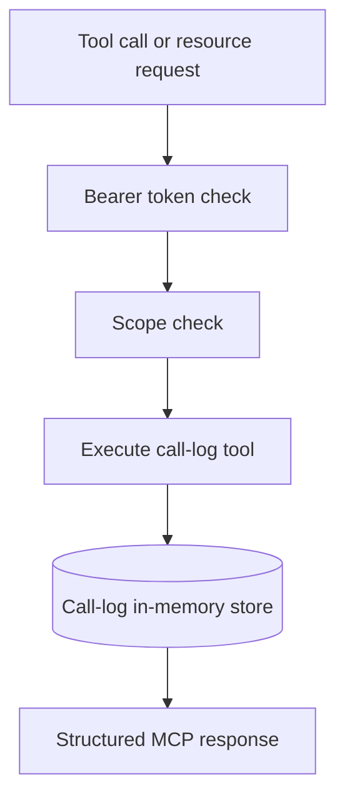
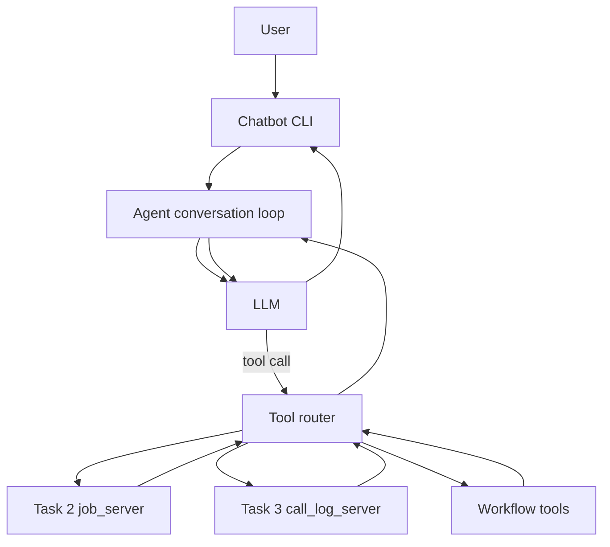
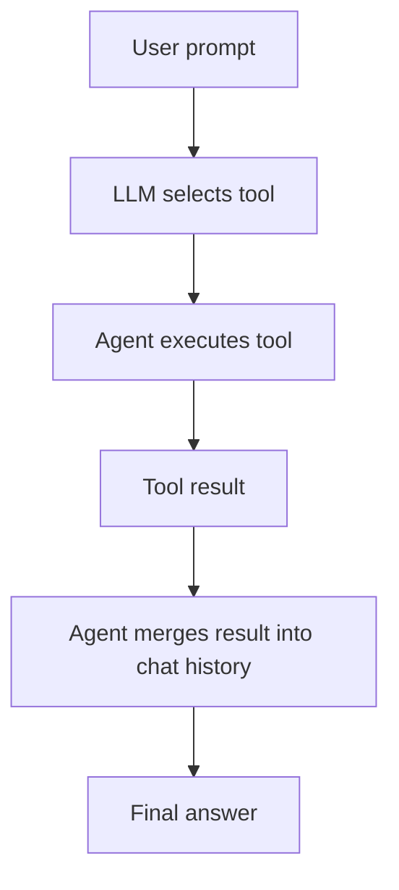
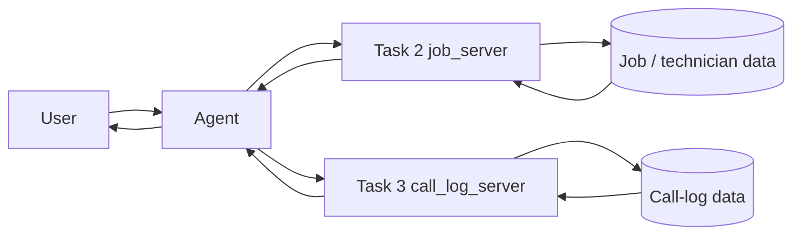
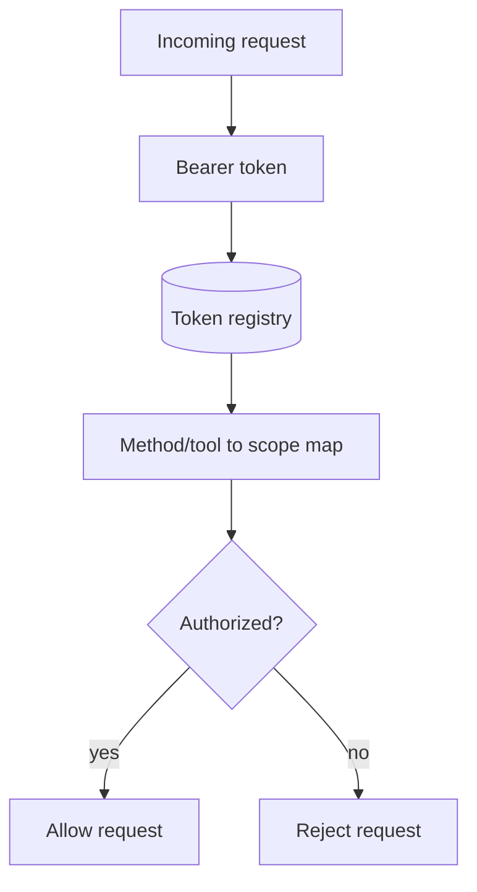

# Demo Architecture

This document shows the complete architecture of the project in a presentation-friendly way.

It includes:

- the Task 2 `job_server` architecture
- the Task 3 `call_log_server` architecture
- the chatbot agent architecture
- the combined data flow between both servers and the agent
- authentication and authorization boundaries

## 1) High-Level System View

The agent is the orchestration layer. It does not own the domain data itself. Instead, it calls both MCP servers and combines their results into workflows and responses.

## 2) Task 2 Architecture: `job_server`

Task 2 is the authenticated MCP server for jobs and technicians.

### Task 2 request flow

### Task 2 auth and authorization boundary

- Authentication confirms the caller is using a valid bearer token.
- Authorization confirms the token has the right scope for the request.
- `read` scope is required for read tools and read-style MCP methods.
- `write` scope is required for write tools.

## 3) Task 3 Architecture: `call_log_server`

Task 3 adds a second MCP server that stores and exposes call-log data.

### Task 3 call-log data flow

The call-log server uses the same general protection model as Task 2:

- bearer token verification
- expiry validation
- scope enforcement
- structured error responses

## 4) Agent Architecture

The agent connects to both MCP servers and exposes their tools to the LLM at runtime.

### Agent data flow

The agent logic is:

1. receive user input
2. ask the LLM whether a tool is needed
3. execute the selected MCP tool or workflow tool
4. feed the result back into the conversation
5. continue until the LLM returns a final response

## 5) Combined Data Flow Between Agent and Both Servers

This is the main integration model:

- Task 2 provides job and technician operations
- Task 3 provides call-log operations
- the agent moves data between them through workflows

## 6) Authentication and Authorization Explanation

### Authentication

Authentication verifies that the caller is known and trusted.

In both servers:

- the client sends a bearer token
- the middleware extracts the token from the request headers
- the token is checked against the hardcoded token registry
- expired or missing tokens are rejected

### Authorization

Authorization verifies that the authenticated token may perform the requested action.

The project uses scope-based authorization:

- `read` scope for read operations
- `write` scope for write operations

The middleware determines the requested MCP method or tool and maps it to the required scope.

### Auth boundary diagram

### What gets protected

- Task 2 MCP tools
- Task 2 resources and prompts
- Task 3 call-log tools, resources, and prompts
- stdio and HTTP access paths

## 7) Why This Design Works

- The servers stay focused on their own domains.
- The agent can combine capabilities without owning the data.
- Authentication and authorization remain inside the server boundary.
- Structured schemas make responses easier to parse.
- The separation makes the system easier to test, debug, and extend.

## 8) Reference Files

If you want the implementation details behind this diagram, the key files are:

- [`src/tasks_mcp_server/task_2/server.py`](src/tasks_mcp_server/task_2/server.py)
- [`src/tasks_mcp_server/task_2/middleware/middaleware.py`](src/tasks_mcp_server/task_2/middleware/middaleware.py)
- [`src/tasks_mcp_server/task_2/auth/token_auth.py`](src/tasks_mcp_server/task_2/auth/token_auth.py)
- [`src/tasks_mcp_server/task_2/auth/scope_auth.py`](src/tasks_mcp_server/task_2/auth/scope_auth.py)
- [`src/tasks_mcp_server/task_3/call_log_server/server.py`](src/tasks_mcp_server/task_3/call_log_server/server.py)
- [`src/tasks_mcp_server/task_3/call_log_server/middleware/middleware.py`](src/tasks_mcp_server/task_3/call_log_server/middleware/middleware.py)
- [`src/tasks_mcp_server/task_3/agent/main.py`](src/tasks_mcp_server/task_3/agent/main.py)
- [`src/tasks_mcp_server/task_3/agent/mcp_clients.py`](src/tasks_mcp_server/task_3/agent/mcp_clients.py)
