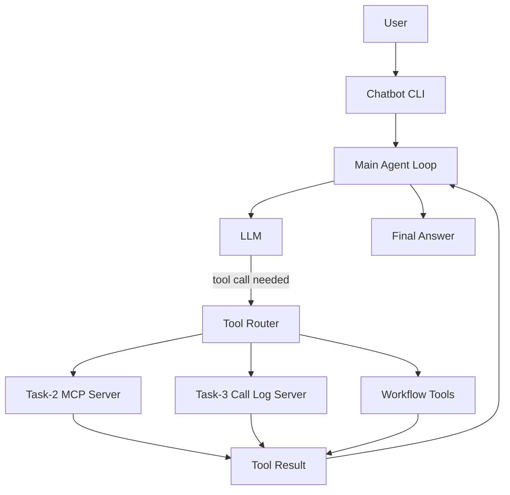

# Chatbot Agent with Multi-Server MCP Tools

## Overview

This project is a Python-based chatbot agent that connects to two MCP servers through a custom client layer and exposes their tools to the LLM at runtime.

The bot follows a tool-using conversation loop:

1. The user asks a question.
2. The LLM decides whether a tool is needed.
3. If needed, the agent calls the matching MCP tool or workflow tool.
4. Tool results are fed back into the conversation.
5. The LLM returns the final answer.

The design keeps the chatbot flexible, so it can respond naturally while still using external capabilities when the task requires them.

## Technologies


## Architecture



### Architecture Notes

- The main agent lives in [`src/agent/main.py`](./src/agent/main.py).
- MCP tools are loaded through a custom multi-server client in [`src/agent/mcp_clients.py`](./src/agent/mcp_clients.py).
- All MCP and workflow tools are merged in [`src/agent/services/tools.py`](./src/agent/services/tools.py).
- The chatbot keeps a message history and repeatedly sends it back to the LLM until no more tool calls are requested.

## Features

- Connects to two MCP servers through a custom client.
- Loads and exposes all available tools from both servers.
- Adds workflow tools on top of MCP tools.
- Automatically calls tools only when the LLM decides they are needed.
- Supports multi-step tool execution inside a single chat turn.
- Logs tool execution details such as latency, server name, and response size.
- Runs as an interactive CLI chatbot.

## Project Structure

```text
src/agent/
  main.py
  mcp_clients.py
  core/
  schemas/
  services/
  workflows/
```

## How It Works

The chatbot uses an iterative loop:

- User input is appended to the conversation history.
- The model receives the history and can return tool calls.
- The agent executes each requested tool.
- Tool responses are injected back into the history.
- The model is called again until it produces a final text response.

This approach lets the bot combine reasoning with external actions in one flow.

## Clone and Run

### 1. Clone the repository

```bash
git clone <repository-url>
cd agent
```

### 2. Install dependencies

```bash
uv sync
```

### 3. Configure environment variables

Create a `.env` file if needed and provide the required API keys or server settings used by the app.

### 4. Start the chatbot

```bash
python -m src.agent.main
```

You can also use the project script if configured in your environment:

```bash
agent
```

## Environment

Typical runtime requirements include:

- Python 3.12 or newer
- Access to the configured MCP servers
- LLM credentials for the configured model provider

## Configuration

The MCP client configuration is defined in [`src/agent/mcp_clients.py`](./src/agent/mcp_clients.py).

If the server URLs, ports, or auth tokens change, update that client configuration before running the bot.

## Tooling Behavior

- MCP tools are discovered from the remote servers at startup.
- Workflow tools are registered locally and mapped alongside MCP tools.
- The agent prints tool execution details to the console for easier debugging.
- Tool failures are captured and returned to the model so it can continue gracefully.

## Use Cases

- Ask questions that may require external data access.
- Trigger server-side actions through MCP tools.
- Run multi-step workflows that combine several tool calls.
- Test and observe how an LLM behaves with live tool access.

## Notes

- This demo README is intentionally written as a project showcase.
- It does not modify any existing source files.
- The architecture diagram is embedded as Mermaid, so it can be rendered in supported Markdown viewers.

## Future Improvements

- Add a visual UI on top of the CLI chatbot.
- Expand the README with screenshots or live usage examples.
- Document each MCP tool and workflow tool in a dedicated reference section.
- Add tests for tool routing and error handling.

